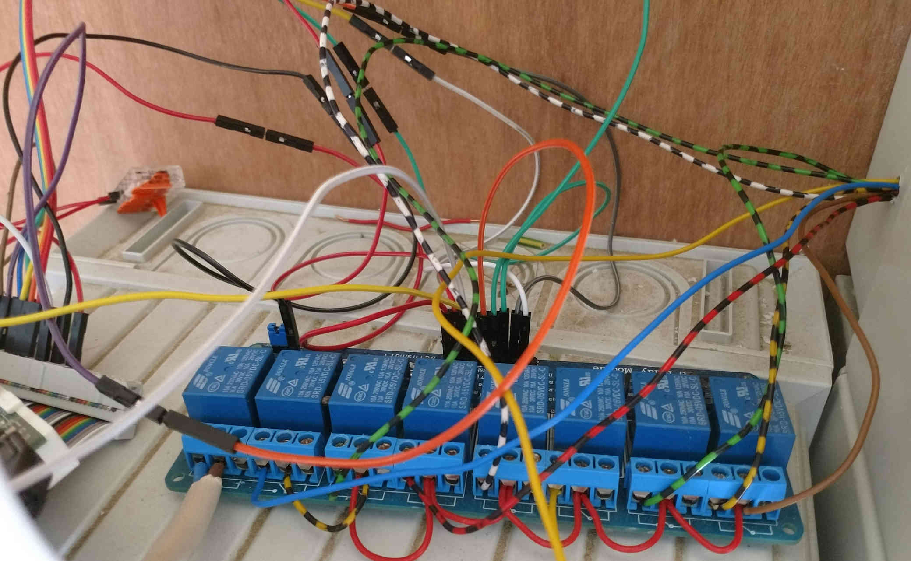

# pidom
Python project controlling teleruptors using Raspberry Pi GPIO

# Automate using cron jobs
```
SETTINGS=settings
PATH=/home/pi/:$PATH


# 22:00H outside: ON, stairs: ON
0 22 * * * pidomcmd.py frontdoorgroupstate --set True True
# 1H outside: OFF, stairs: ON
0 1 * * * pidomcmd.py frontdoorgroupstate --set False True
# 6H outside: OFF, stairs: OFF
0 6 * * * pidomcmd.py frontdoorgroupstate --set False False

# 12H screen: DOWN
0 12 * * * pidomcmd.py screen --direction down
# 4H screen: UP
0 4 * * * pidomcmd.py screen --direction up
```

# Images wiring



